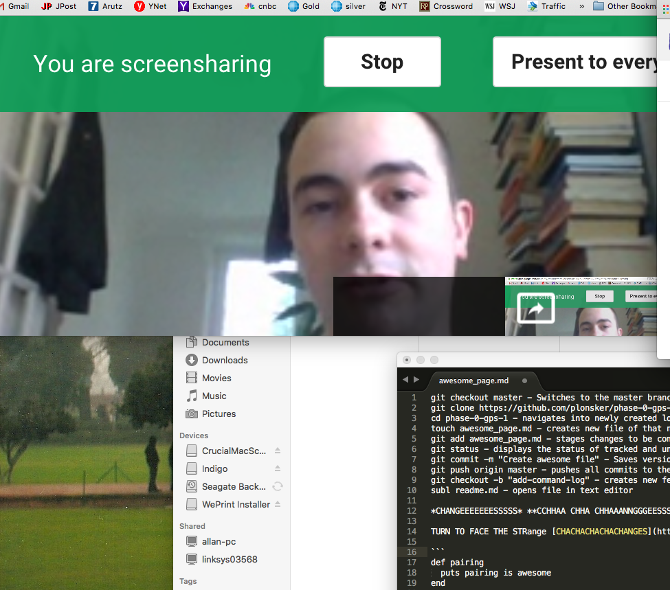

git checkout master - Switches to the master branch
git clone https://github.com/plonsker/phase-0-gps-1.git - creates a copy of the remote repository onto a local computer
cd phase-0-gps-1 - navigates into newly created local directory
touch awesome_page.md - creates new file of that name
git add awesome_page.md - stages changes to be committed 
git status - displays the status of tracked and untracked changes
git commit -m "Create awesome file" - Saves version of the file as it currently is
git push origin master - pushes all commits to the original repository on the master branch 
git checkout -b "add-command-log" - creates new feature branch 
subl readme.md - opens file in text editor

*CHANGEEEEEEESSSSS* **CCHHAA CHHA CHHAAANNGGGEESSSSS**.

TURN TO FACE THE STRange [CHACHACHACHACHANGES](https://www.youtube.com/watch?v=pl3vxEudif8)

```
def pairing
  puts pairing is awesome
end

pairing
```

UMMMMMM this is us working 